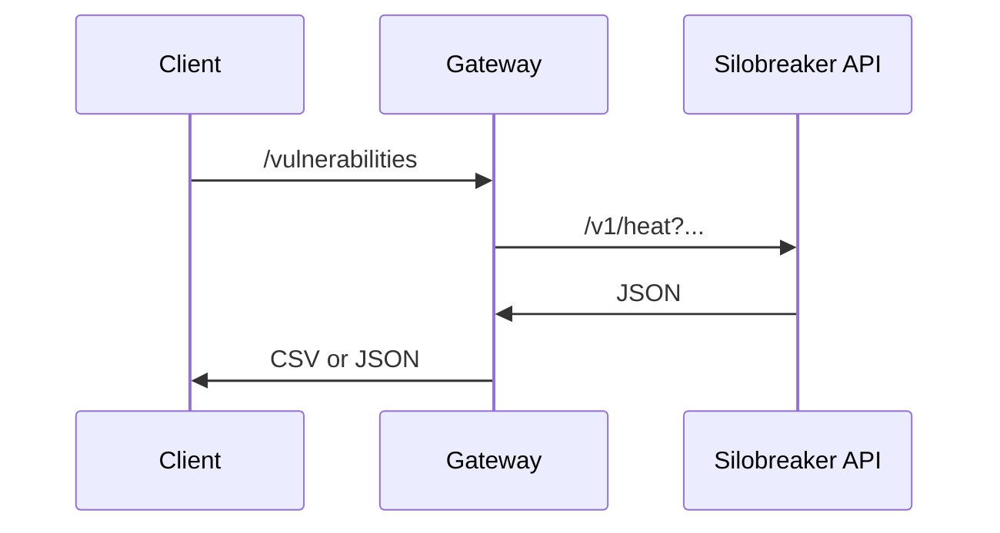

# API Gateway

The Silobreaker API currently does not "speak the language” of cyber security. The endpoints are generic, and to query for cyber related information an API user need to know the Silobreaker search syntax.

For example, a customer that wants to find the top trending vulnerabilities today would use the API call
`https://api.silobreaker.com/v1/heat?q=fromdate:-24h&tq=entitytype:vulnerability`

Your task is to build an API gateway in the language/framework of your choice that makes it easy for a user used to the cyber security domain to understand the API - so that the above call instead would be
`https://your-gateway/vulnerabilities`

Let's assume that the user always wants the last 24h hours for now, so the endpoint does not need to take any parameters.

The following call should be issued by the gateway in order to get data for the `/vulnerabilities` endpoint:

```url
https://api.silobreaker.com/v1/heat?q=fromdate:-24h&tq=entitytype:vulnerability&apiKey=1c1phx2l0urct41di8x2&digest=xFPasGTSqwjYGn3aiTQ9%2BeAtLFU%3D
```

The end users usually want to import the API response directly into 3rd-party products. Please make this easy by implementing the gateway so that the default response is CSV. You can optionally support "pass-thru" JSON as well, where the Silobreaker API response is used without modification.

## Bonus tasks - optional

You can do any, or none of these.

1. Run your gateway in a Docker container.

2. Extend the API Gateway to accept arbitary filters for the `/vulnerabilities` endpoint. In order to do so, you need to create signed API requests to our API using an API key consisting of two parts - one secret and one public. Our [API GitHub repository](https://github.com/Silobreaker/Api) contains code samples and documentation in several languages for how to create the [signed API call](https://github.com/Silobreaker/Api/tree/master/samples/node). The filter needs to be appended to the `q` query parameter as that is the parameter Silobreaker uses to filter results. To combine it with more filters (such as `fromdate:-24h`) you concatenate them using `and` as a separator. Once you’re finished, a user should be able to query
   `https://your-gateway/vulnerabilities?filter=Wordpress`
   to get relevant vulnerabilities for Wordpress mentioned last 24 hours.

## Call sequence



# API key

API: 1c1phx2l0urct41di8x2
Shared: w02am957y2awbisxxe5f
URL: https://api.silobreaker.com/v1/heat?q=fromdate:-24h&tq=entitytype:vulnerability&apiKey=1c1phx2l0urct41di8x2&digest=xFPasGTSqwjYGn3aiTQ9%2BeAtLFU%3D
